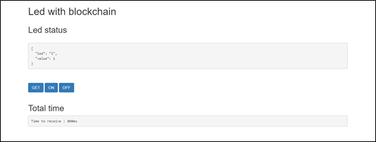
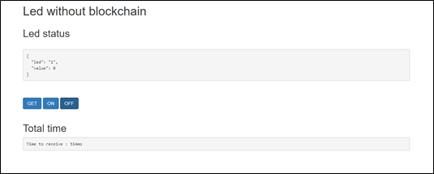
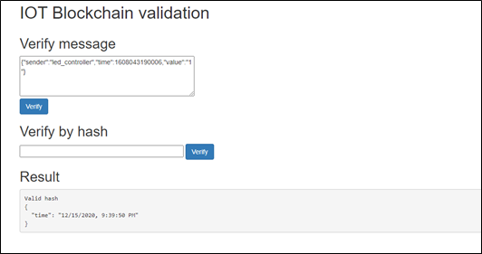
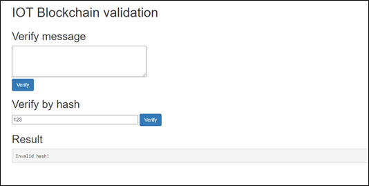

# Project 3

## Description

This is repository for project3 "IOT with blockchain".  

## Install

### Rasberry Pi 3B+

There are 3 components to run on rasberry pi :  
 + sensors : 
 ```
 npm install
 node blink.js
 ```
  Led connects with GPIO 26.
 + server:
 ```
 cd server/wot-server
 npm install
 node wot-servers.js
 ```
 + mqtt-server :
 ```
 mosquitto -p 1028 
 ```

If you are already install all packages for nodejs, simply run `./run.sh`.  

### Run blockchain 

Install Ganache.  
Add new project with `truffle-config.js`.  
Blockchain must be in the same network as rasberry pi.

## Demo

+ Led with blockchain :

Access at url : `http://<host-ip>:8484/led`.  



+ Led without blockchain :

Access at url : `http://<host-ip>:8484/led_normal`.  



+ Blockchain validation :

Access at url : `http://<host-ip>:8484`.  




